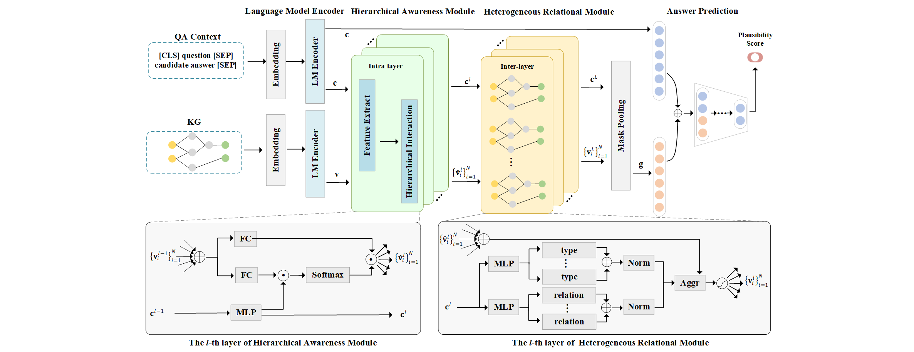

# DRLK: Dynamic Hierarchical Reasoning with Language Model and Knowledge Graphs for Question Answering

This repo provides the source code & data of our paper [DRLK: Dynamic Hierarchical Reasoning with Language Model and Knowledge Graphs for Question Answering]() (2022).


For convenience, all data, checkpoints and codes can be downloaded [Google Drive](https://drive.google.com/drive/folders/1Q0GaDKWMvbkqbisgRbckxW5jTmZs5ViK?usp=sharing).

<p align="center">
  
</p>

## 1. Dependencies

- [Python](<https://www.python.org/>) == 3.8.12
- [PyTorch](<https://pytorch.org/get-started/locally/>) == 1.8.1
- [transformers](<https://github.com/huggingface/transformers/tree/v3.4.0>) == 4.17.0

## 2. Download data
**We use preprocessed data from the repository of [QA-GNN](https://github.com/michiyasunaga/qagnn). If you want to directly download preprocessed data, please jump to the next subsection.**

The resulting file structure should look like this:

```plain
├── README.md
├── data/
|    ├── cpnet/                     (prerocessed cpnet)
|    ├── ddb/                       (prerocessed ddb)
|    ├── csqa/
|    ├── obqa/
|    ├── medqa_usmle/
|        ├── train_rand_split.jsonl
|        ├── dev_rand_split.jsonl
|        ├── test_rand_split_no_answers.jsonl
|        ├── statement/             (converted statements)
|        ├── grounded/              (grounded entities)
|        ├── graphs/                (extracted subgraphs)
|        ├── ...
|    ├── medmcqa/
├── utils/
|    ├── data_utils.py
|    ├── layers.py
|    ├── optimization_utils.py
|    ├── parser_utils.py
|    ├── utils.py
├── modeling
|    ├── modeling_drlk.py
|    ├── modeling_lm.py
├── logs/
├── drlk.py
├── eval_drlk_medmcqa.sh
├── eval_drlk_medqa_usmle.sh
├── requirements.txt
├── run_drlk_medmcqa.sh
└── run_drlk_medqa_usmle.sh
```
## 3. Training DRLK 
(Assuming just one GPU)
Prepare prediction and training directory
```
mkdir -p {preds_res1,saved_models1}/{medqa_usmle,medmcqa,csqa,obqa}
```

To train DRLK on MedQA-USMLE, run
```
bash run_drlk_medqa_usmle.sh train
```

To train DRLK on MedMCQA, run
```
bash run_drlk_medmcqa.sh train
```

## 4. Pretrained model checkpoints

You can download all pretrained DRLK models [Google Drive](https://drive.google.com/drive/folders/1Q0GaDKWMvbkqbisgRbckxW5jTmZs5ViK?usp=sharing).

## 5. Evaluating a pretrained model checkpoint

To evaluate DRLK on MedQA-USMLE, run
```
bash eval_drlk_medqa_usmle.sh eval
```

To evaluate DRLK on MedMCQA, run
```
bash eval_drlk_medmcqa.sh eval
```

## 6. Acknowledgment
This repo is built upon the following work:
```
Scalable multi-hop relational reasoning for knowledge-aware question answering
https://github.com/INK-USC/MHGRN

QA-GNN: Question Answering using Language Models and Knowledge Graphs
https://github.com/michiyasunaga/qagnn
```
Many thanks to the authors and developers!

## Others
If you use any of our code, processed data or pretrained models, please cite:
```bib

```